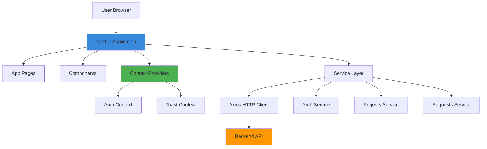
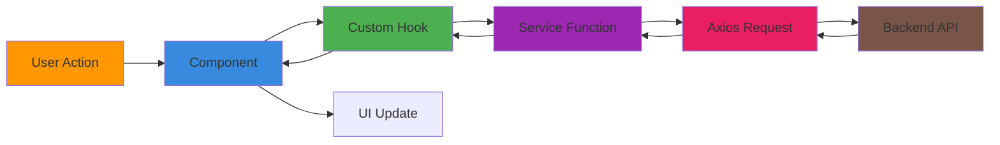
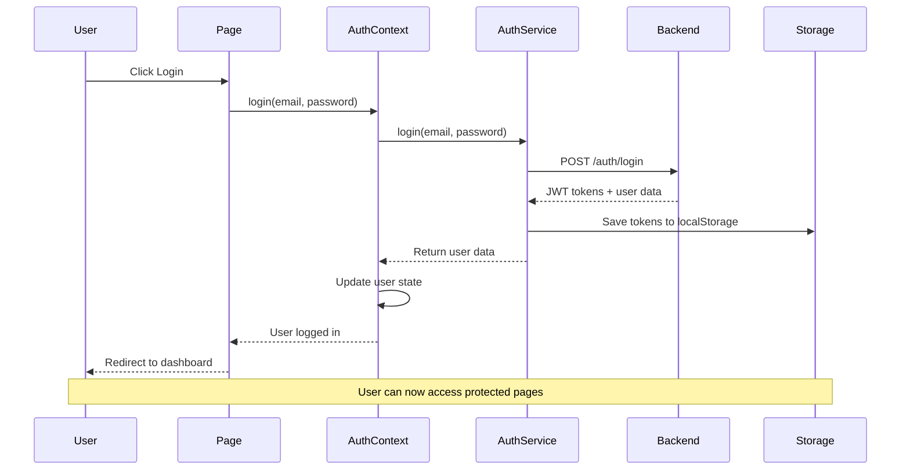
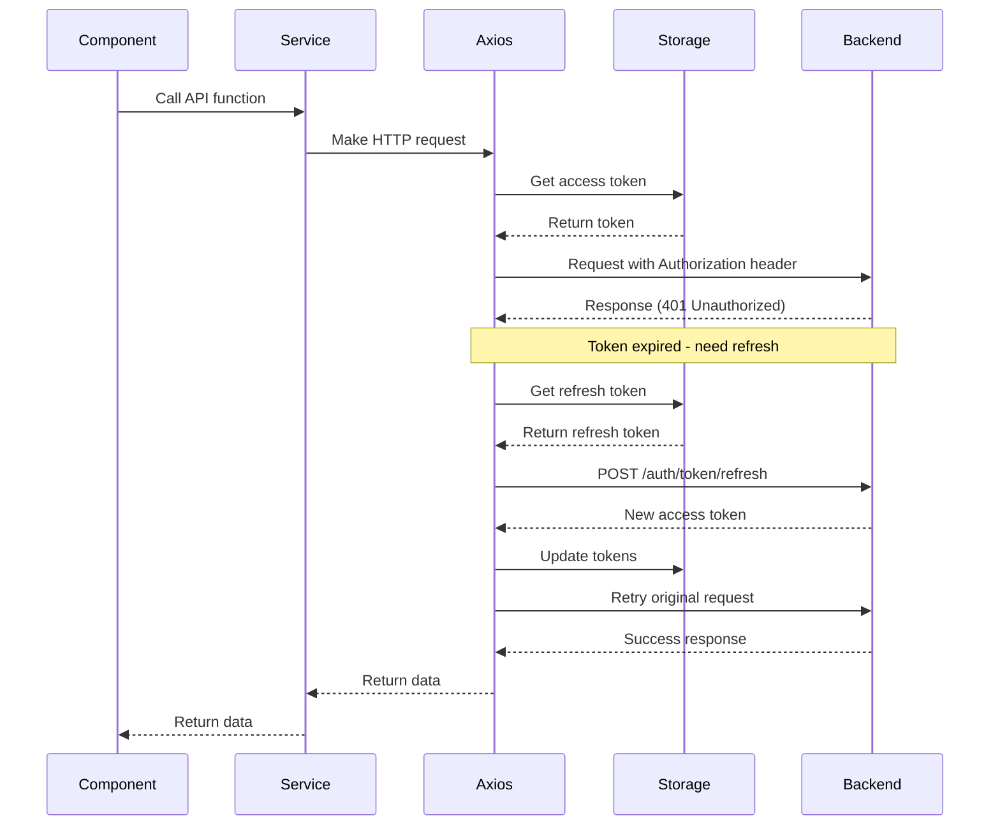
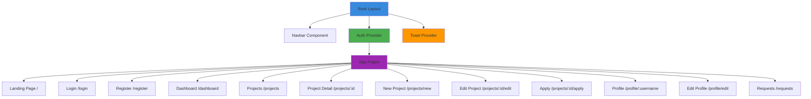
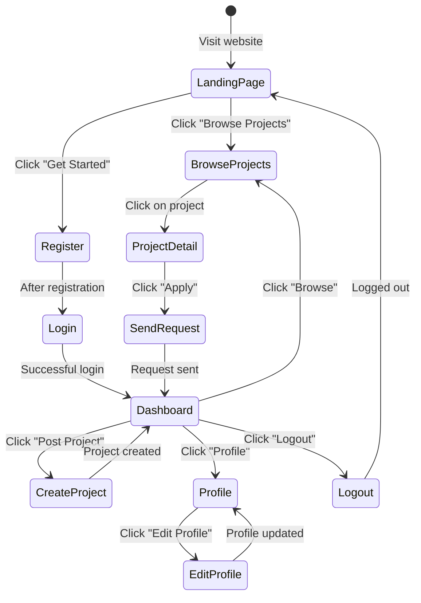
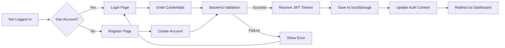
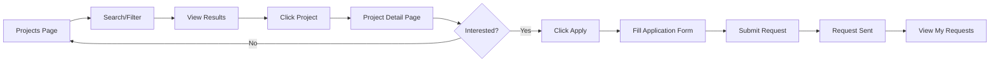

# DevCollab Frontend

A modern web application for developer collaboration built with Next.js, React, and Tailwind CSS. This frontend connects developers who want to build projects together.

## Table of Contents

- [What is this application?](#what-is-this-application)
- [How it works](#how-it-works)
- [Tech Stack](#tech-stack)
- [Project Structure](#project-structure)
- [Architecture Overview](#architecture-overview)
- [Key Features](#key-features)
- [User Flow](#user-flow)
- [Setup Instructions](#setup-instructions)
- [Environment Configuration](#environment-configuration)
- [Deployment](#deployment)
- [Drawbacks/Issues needed to be fix](#drawbacksissues-needed-to-be-fix)

## What is this application?

DevCollab Frontend is a web application that helps developers find and collaborate on projects. Think of it as a matchmaking service for developers - if you have a project idea but need help, or if you want to join existing projects, this app connects you with the right people.

**Main things you can do:**
- Browse and search for projects that need collaborators
- Post your own projects and specify what skills you need
- Send requests to join projects you're interested in
- Manage collaboration requests (accept or reject)
- Create and update your developer profile

## How it works

The application is built as a **single-page application** using Next.js. When you use the app, here's what happens:

1. **You visit the website** - The app loads in your browser
2. **You log in or register** - The app sends your information to the backend server
3. **You get a token** - The server gives you a special "access pass" (JWT token) that proves who you are
4. **You use the app** - Every time you do something, the app shows your token to the server
5. **Token refresh** - If your token expires, the app automatically gets a new one without you noticing

## Tech Stack

### Core Technologies
- **Next.js 16.2.4** - A React framework that makes building web apps easier
- **React 19.2.4** - A JavaScript library for building user interfaces
- **Tailwind CSS 4** - A utility-first CSS framework for styling

### Communication & Data
- **Axios 1.16.0** - A library for making requests to the backend server
- **JWT (JSON Web Tokens)** - For secure user authentication

### Development Tools
- **ESLint** - For code quality and consistency
- **React Compiler** - Optimizes React components automatically

### Deployment
- **Vercel** - Platform for deploying Next.js applications

## Project Structure

The project is organized in a simple, logical way:

```
devcollab-frontend/
├── src/
│   ├── app/                    # Main application pages (Next.js App Router)
│   │   ├── page.js            # Home/landing page
│   │   ├── login/             # Login page
│   │   ├── register/          # Registration page
│   │   ├── dashboard/         # User dashboard
│   │   ├── projects/          # Project-related pages
│   │   ├── profile/           # User profile pages
│   │   ├── requests/          # Collaboration requests page
│   │   ├── layout.js          # Main layout wrapper
│   │   └── globals.css        # Global styles
│   ├── components/            # Reusable UI components
│   │   ├── layout/           # Layout components (Navbar, ProtectedRoute)
│   │   ├── projects/         # Project-specific components
│   │   ├── requests/         # Request-related components
│   │   └── ui/               # General UI components (Toast, Skeleton, etc.)
│   ├── context/              # Global state management
│   │   ├── AuthContext.js    # User authentication state
│   │   └── ToastContext.js   # Notification system
│   ├── hooks/                # Custom React hooks
│   │   ├── useAuth.js        # Authentication hook
│   │   └── useToast.js       # Toast notification hook
│   ├── services/             # API communication layer
│   │   ├── api.js            # Main axios instance with interceptors
│   │   ├── auth.js           # Authentication API calls
│   │   ├── projects.js       # Project API calls
│   │   ├── requests.js       # Request API calls
│   │   └── users.js          # User API calls
│   └── utils/                # Utility functions
│       └── parseApiError.js  # Error handling helper
├── public/                   # Static files
├── .env                      # Environment variables
├── package.json             # Project dependencies
├── next.config.mjs          # Next.js configuration
└── vercel.json              # Vercel deployment config
```

## Architecture Overview

### High-Level Architecture



### Component Data Flow



### Authentication Flow



### API Request Flow with Token Refresh



### Page Structure and Navigation



## Key Features

### 1. Authentication System
- **JWT-based authentication** using access and refresh tokens
- **Automatic token refresh** - tokens are renewed automatically when they expire
- **Protected routes** - certain pages can only be accessed by logged-in users
- **Cross-tab synchronization** - logging out in one tab logs you out in all tabs

### 2. State Management
- **Context API** for global state (user authentication, notifications)
- **Custom hooks** for easy access to state (useAuth, useToast)
- **localStorage** for persisting tokens and user data

### 3. API Communication
- **Centralized axios instance** with request/response interceptors
- **Automatic token injection** - every request includes the authentication token
- **Error handling** - standardized error parsing and user-friendly messages
- **Service layer** - organized API calls by feature (auth, projects, requests, users)

### 4. User Interface
- **Responsive design** - works on mobile, tablet, and desktop
- **Tailwind CSS** for consistent, modern styling
- **Loading states** - skeleton loaders while data is being fetched
- **Toast notifications** - success/error messages for user feedback
- **Empty states** - friendly messages when there's no data to show

### 5. Project Management
- **Project browsing** with search and filtering
- **Project creation** with tech stack and role specification
- **Project editing** for project owners
- **Collaboration requests** to join projects
- **Request management** for project owners

## User Flow

### New User Journey



### Authentication Flow



### Project Discovery and Application



## Setup Instructions

### Prerequisites
- Node.js (version 18 or higher recommended)
- npm or yarn package manager
- A running backend server (see backend README)

### Local Development Setup

1. **Navigate to the frontend directory**
   ```bash
   cd devcollab-frontend
   ```

2. **Install dependencies**
   ```bash
   npm install
   # or
   yarn install
   ```

3. **Set up environment variables**
   
   Create a `.env` file in the project root:
   ```env
   NEXT_PUBLIC_API_URL=http://localhost:8000/api
   ```
   
   Replace `http://localhost:8000/api` with your backend API URL.

4. **Run the development server**
   ```bash
   npm run dev
   # or
   yarn dev
   ```

5. **Open your browser**
   
   Navigate to [http://localhost:3000](http://localhost:3000)

### Building for Production

```bash
npm run build
# or
yarn build
```

### Running Production Build

```bash
npm start
# or
yarn start
```

## Environment Configuration

### Environment Variables

The application uses environment variables for configuration. These are defined in the `.env` file:

| Variable | Description | Example |
|----------|-------------|---------|
| `NEXT_PUBLIC_API_URL` | Backend API base URL | `http://localhost:8000/api` |

### Development vs Production

**Development:**
- API URL: Local backend server
- Hot reloading enabled
- Debug mode on

**Production:**
- API URL: Production backend server
- Optimized build
- Static assets served from CDN

## Deployment

### Vercel Deployment

The project is configured for easy deployment on Vercel:

1. **Connect your repository to Vercel**
2. **Configure environment variables** in Vercel dashboard
3. **Deploy** - Vercel will automatically build and deploy

#### Vercel Configuration
- **Framework:** Next.js (auto-detected)
- **Build Command:** `npm run build`
- **Output Directory:** `.next`
- **Install Command:** `npm install`

### Manual Deployment

For other platforms:

1. **Build the application:**
   ```bash
   npm run build
   ```

2. **Set environment variables** on your hosting platform

3. **Deploy the `.next` folder** and `package.json`

4. **Start the application:**
   ```bash
   npm start
   ```

## Key Components Explanation

### AuthContext
Manages user authentication state across the entire application. It handles:
- User login/logout
- Storing and retrieving user data
- Cross-tab synchronization
- Token management

### ToastContext
Provides a notification system for showing success/error messages to users.

### ProtectedRoute
A wrapper component that prevents unauthenticated users from accessing certain pages.

### Service Layer
Organized functions that communicate with the backend API:
- `auth.js` - Login, register, logout
- `projects.js` - CRUD operations for projects
- `requests.js` - Collaboration request management
- `users.js` - User profile operations

### API Interceptor
The axios instance in `api.js` automatically:
- Adds authentication tokens to requests
- Refreshes expired tokens
- Handles authentication failures
- Redirects to login on token failure

## Performance Optimizations

- **React Compiler** - Automatically optimizes React components
- **Code splitting** - Next.js automatically splits code by route
- **Image optimization** - Next.js Image component for optimized images
- **Lazy loading** - Components load only when needed
- **Static generation** - Some pages are pre-built for faster loading

## Browser Support

The application supports all modern browsers:
- Chrome (latest)
- Firefox (latest)
- Safari (latest)
- Edge (latest)

## Troubleshooting

### Common Issues

**Problem:** API requests failing
- **Solution:** Check that `NEXT_PUBLIC_API_URL` is correct and backend is running

**Problem:** Login not working
- **Solution:** Clear browser localStorage and try again

**Problem:** Pages not loading
- **Solution:** Ensure dependencies are installed with `npm install`

**Problem:** Token refresh errors
- **Solution:** Check backend token refresh endpoint is working

## Contributing

When contributing to this project:
1. Follow the existing code structure
2. Use Tailwind CSS for styling
3. Create reusable components when possible
4. Add proper error handling
5. Test on different screen sizes

## Drawbacks/Issues needed to be fix

### Security Issues

#### 1. localStorage for Sensitive Data
**Issue:** JWT tokens and user data are stored in localStorage, which is vulnerable to XSS attacks.

**Problems:**
- Accessible by any JavaScript code running on the page
- Vulnerable to cross-site scripting (XSS) attacks
- Tokens can be stolen by malicious scripts
- No protection against token theft

**Recommendation:** Use httpOnly cookies for token storage:
```javascript
// Store tokens in httpOnly cookies set by the backend
// Frontend only stores non-sensitive user session data
```

#### 2. Missing CSRF Protection
**Issue:** No CSRF token implementation for state-changing requests.

**Problems:**
- Vulnerable to cross-site request forgery attacks
- Malicious sites can make requests on behalf of authenticated users
- Can lead to unauthorized actions (project deletion, etc.)
- No protection against forged requests

**Recommendation:** Implement CSRF tokens for all state-changing operations.

#### 3. Missing Input Sanitization
**Issue:** User inputs are not properly sanitized before display or API submission.

**Problems:**
- Risk of XSS attacks through user-generated content
- Malicious scripts can be injected through project descriptions, messages, etc.
- Can compromise user sessions and steal data
- No validation of URLs in user profiles

**Recommendation:** Implement proper input sanitization and validation:
```javascript
import DOMPurify from 'dompurify';

const sanitizedDescription = DOMPurify.sanitize(userInput);
```

### State Management Issues

#### 4. localStorage as Single Source of Truth
**Issue:** Authentication state relies solely on localStorage without proper state synchronization.

**Problems:**
- State can become inconsistent across browser tabs
- Race conditions between multiple tabs
- No proper state management for complex scenarios
- Difficult to handle token expiration gracefully

**Recommendation:** Implement proper state management with Redux or Zustand, or use React Query for server state.

#### 5. Missing Error Boundaries
**Issue:** No error boundaries to handle component errors gracefully.

**Problems:**
- Application crashes on component errors
- Poor user experience when something goes wrong
- No graceful degradation
- Difficult to debug production errors

**Recommendation:** Implement React error boundaries:
```javascript
class ErrorBoundary extends React.Component {
  componentDidCatch(error, errorInfo) {
    logErrorToService(error, errorInfo);
  }
  render() {
    if (this.state.hasError) {
      return <ErrorFallback />;
    }
    return this.props.children;
  }
}
```

### Performance Issues

#### 6. No Data Caching Strategy
**Issue:** No caching mechanism for API responses, leading to repeated requests.

**Problems:**
- Unnecessary API calls for the same data
- Slower page loads and navigation
- Increased server load
- Poor offline experience

**Recommendation:** Implement React Query or SWR for data caching and synchronization:
```javascript
import { useQuery } from '@tanstack/react-query';

const { data, isLoading } = useQuery({
  queryKey: ['projects'],
  queryFn: getProjects,
  staleTime: 5 * 60 * 1000, // 5 minutes
});
```

#### 7. Missing Code Splitting for Large Components
**Issue:** Large components are loaded even when not needed.

**Problems:**
- Larger initial bundle size
- Slower initial page load
- Poor performance on slow connections
- Unnecessary JavaScript execution

**Recommendation:** Implement dynamic imports for heavy components:
```javascript
const ProjectForm = dynamic(() => import('./ProjectForm'), {
  loading: () => <SkeletonLoader />
});
```

#### 8. No Image Optimization
**Issue:** User avatars and images are not optimized.

**Problems:**
- Large image files slow down page loads
- No responsive image loading
- Poor performance on mobile devices
- Increased bandwidth usage

**Recommendation:** Use Next.js Image component with optimization:
```javascript
<Image 
  src={user.avatar} 
  alt={user.username}
  width={100}
  height={100}
  loading="lazy"
/>
```

### Code Quality Issues

#### 9. Inconsistent Error Handling
**Issue:** Error handling varies across components (some use alerts, some use toasts, some show inline).

**Problems:**
- Inconsistent user experience
- Difficult to maintain error handling logic
- Some errors go unnoticed by users
- No centralized error tracking

**Recommendation:** Implement consistent error handling with a centralized error manager.

#### 10. Commented-Out Debug Code
**Issue:** Debug comments and incomplete code left in production files (e.g., RequestCard.js line 49).

**Problems:**
- Clutters the codebase
- Indicates incomplete development
- May contain sensitive information
- Unprofessional code presentation

**Recommendation:** Remove all debug comments and incomplete code before deployment.

#### 11. Missing PropTypes or TypeScript
**Issue:** No type checking for component props and function parameters.

**Problems:**
- Runtime errors due to incorrect prop types
- Difficult to refactor without breaking things
- No IDE autocomplete for props
- Harder to catch bugs during development

**Recommendation:** Implement TypeScript or PropTypes:
```javascript
import PropTypes from 'prop-types';

RequestCard.propTypes = {
  request: PropTypes.object.isRequired,
  onStatusUpdate: PropTypes.func
};
```

#### 12. Magic Numbers and Strings
**Issue:** Hardcoded values throughout the codebase (e.g., slice(0, 200), timeouts, etc.).

**Problems:**
- Difficult to maintain and update
- No clear meaning behind numbers
- Inconsistent behavior across components
- Hard to test edge cases

**Recommendation:** Extract constants to a configuration file:
```javascript
const CONFIG = {
  MESSAGE_TRUNCATE_LENGTH: 200,
  TOAST_DURATION: 3000,
  API_TIMEOUT: 10000
};
```

### User Experience Issues

#### 13. Missing Loading States for Some Operations
**Issue:** Some async operations don't show loading indicators.

**Problems:**
- Users don't know if action is being processed
- Can lead to duplicate submissions
- Poor perceived performance
- User confusion

**Recommendation:** Implement loading states for all async operations.

#### 14. No Optimistic UI Updates
**Issue:** UI doesn't update until API response is received.

**Problems:**
- Slower perceived performance
- Poor user experience for fast operations
- Users think actions failed
- No immediate feedback

**Recommendation:** Implement optimistic updates with rollback on failure:
```javascript
const updateProject = async (updates) => {
  const oldData = projects;
  setProjects(prev => ({ ...prev, ...updates })); // Optimistic
  
  try {
    await api.patch(`/projects/${id}`, updates);
  } catch (error) {
    setProjects(oldData); // Rollback
  }
};
```

#### 15. No Offline Support
**Issue:** Application doesn't work when offline.

**Problems:**
- Poor user experience on unstable connections
- Can't view previously loaded content offline
- No service worker for caching
- Users lose work on connection loss

**Recommendation:** Implement service worker and offline caching strategies.

#### 16. Missing Form Validation
**Issue:** Limited client-side form validation before API submission.

**Problems:**
- Unnecessary API calls for invalid data
- Poor user experience with delayed error feedback
- Server-side validation only
- Inconsistent validation rules

**Recommendation:** Implement comprehensive form validation:
```javascript
import { useForm } from 'react-hook-form';

const { register, handleSubmit, formState: { errors } } = useForm({
  validationSchema: projectSchema
});
```

### Accessibility Issues

#### 17. Missing ARIA Labels and Roles
**Issue:** Interactive elements lack proper ARIA attributes.

**Problems:**
- Poor accessibility for screen readers
- Navigation difficult for keyboard users
- Not compliant with WCAG guidelines
- Excludes users with disabilities

**Recommendation:** Add proper ARIA labels and roles:
```javascript
<button 
  aria-label="Accept collaboration request"
  role="button"
>
  Accept
</button>
```

#### 18. Missing Keyboard Navigation Support
**Issue:** Some interactive elements don't support keyboard navigation.

**Problems:**
- Can't use application without mouse
- Poor accessibility
- Not compliant with accessibility standards
- Difficult for users with motor disabilities

**Recommendation:** Ensure all interactive elements are keyboard accessible.

#### 19. Poor Color Contrast
**Issue:** Some text elements may have insufficient color contrast.

**Problems:**
- Difficult to read for users with visual impairments
- Not WCAG compliant
- Poor readability in various lighting conditions
- Accessibility issues

**Recommendation:** Audit and fix color contrast ratios to meet WCAG AA standards.

### Testing Issues

#### 20. No Test Coverage
**Issue:** No tests written for components, hooks, or services.

**Problems:**
- No assurance that code changes don't break functionality
- Difficult to refactor safely
- Higher risk of bugs in production
- No safety net for development

**Recommendation:** Implement comprehensive testing:
```javascript
// Component tests with React Testing Library
// Hook tests with @testing-library/react-hooks
// Service tests with MSW (Mock Service Worker)
```

### Architecture Issues

#### 21. Tight Coupling Between Components
**Issue:** Components are tightly coupled to specific data structures and API responses.

**Problems:**
- Difficult to reuse components
- Changes to API break components
- Hard to test components in isolation
- Poor maintainability

**Recommendation:** Implement proper abstraction layers and component composition patterns.

#### 22. Missing API Versioning Strategy
**Issue:** No handling for API version changes in the frontend.

**Problems:**
- Breaking API changes break the frontend
- Can't support multiple API versions
- Difficult to migrate to new API versions
- No backward compatibility

**Recommendation:** Implement API version handling in service layer.

#### 23. No Request Cancellation
**Issue:** API requests can't be cancelled when components unmount.

**Problems:**
- Memory leaks from unmounted components
- Unnecessary API calls waste resources
- Can cause state updates on unmounted components
- React warnings about state updates on unmounted components

**Recommendation:** Implement request cancellation with AbortController:
```javascript
useEffect(() => {
  const controller = new AbortController();
  
  fetchProjects({ signal: controller.signal });
  
  return () => controller.abort();
}, []);
```

### SEO and Analytics Issues

#### 24. Missing Meta Tags and Open Graph
**Issue:** Pages lack proper meta tags for SEO and social sharing.

**Problems:**
- Poor search engine optimization
- Bad social media preview cards
- Missing Open Graph tags
- No structured data for rich snippets

**Recommendation:** Implement proper meta tags and Open Graph:
```javascript
export const metadata = {
  title: 'DevCollab - Find Developer Collaborators',
  description: 'Connect with developers to build projects together',
  openGraph: {
    title: 'DevCollab',
    description: 'Find collaborators for your projects',
    images: ['/og-image.png']
  }
};
```

#### 25. No Analytics Integration
**Issue:** No user analytics or error tracking implemented.

**Problems:**
- No insight into user behavior
- Can't track conversion funnels
- No error tracking in production
- Difficult to make data-driven decisions

**Recommendation:** Implement analytics (Google Analytics, Mixpanel) and error tracking (Sentry).

### Missing Features

#### 26. No Real-Time Updates
**Issue:** No WebSocket or real-time update mechanism.

**Problems:**
- Users must refresh to see new collaboration requests
- No live notifications
- Poor collaboration experience
- Outdated information display

**Recommendation:** Implement WebSocket connections for real-time updates.

#### 27. No File Upload Handling
**Issue:** Missing proper file upload handling for avatars and project files.

**Problems:**
- Can't upload project images or documents
- No avatar upload functionality
- Limited user profile customization
- Poor user experience

**Recommendation:** Implement proper file upload with progress indicators and validation.

#### 28. No Search History or Recent Activity
**Issue:** No tracking of user's recent searches or activity.

**Problems:**
- Can't easily revisit previous searches
- No personalized recommendations
- Poor user experience
- Missing engagement features

**Recommendation:** Implement search history and activity tracking.

### Deployment and DevOps Issues

#### 29. Missing Environment-Specific Configurations
**Issue:** Limited environment-specific configuration management.

**Problems:**
- Difficult to manage different environments
- Risk of using wrong configuration
- No proper staging environment setup
- Configuration drift between environments

**Recommendation:** Implement proper environment configuration management.

#### 30. No Performance Monitoring
**Issue:** No performance monitoring or alerting system.

**Problems:**
- Can't detect performance degradation
- No visibility into application performance
- Difficult to optimize user experience
- No alerting for performance issues

**Recommendation:** Implement performance monitoring (Lighthouse CI, Web Vitals monitoring).

### Browser Compatibility Issues

#### 31. Limited Browser Testing
**Issue:** No systematic testing across different browsers and devices.

**Problems:**
- May not work on older browsers
- Responsive design issues on some devices
- Inconsistent behavior across browsers
- Poor user experience for some users

**Recommendation:** Implement cross-browser testing with tools like BrowserStack or Sauce Labs.

## License

[Specify your license here]

## Support

For issues and questions, please open an issue in the repository or contact the development team.
