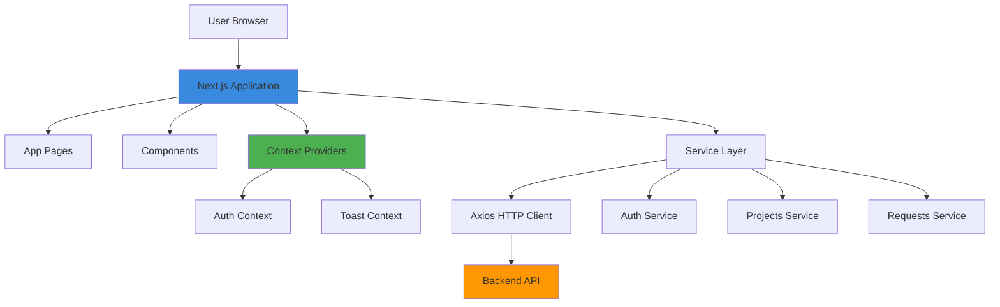
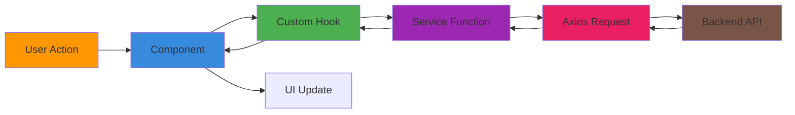
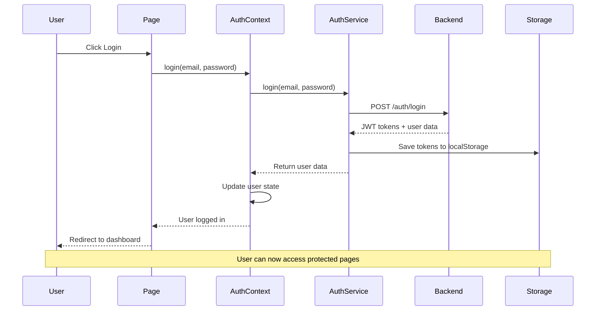
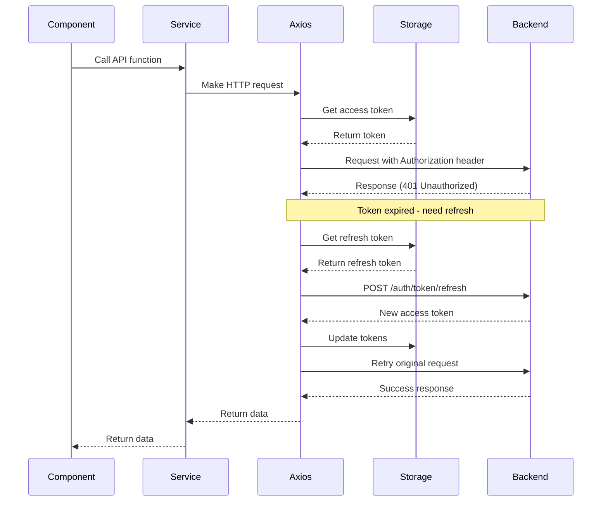
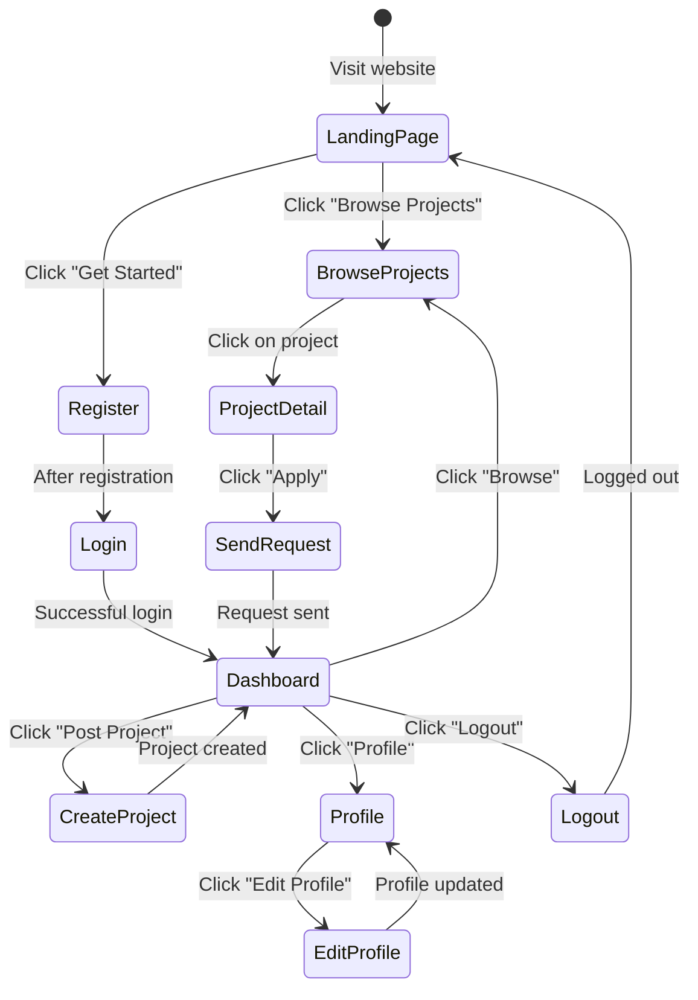
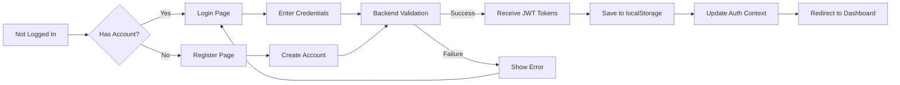
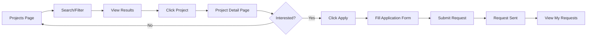

# DevCollab Frontend

A modern web application for developer collaboration built with Next.js, React, and Tailwind CSS. This frontend connects developers who want to build projects together.

## Table of Contents

- [What is this application?](#what-is-this-application)
- [How it works](#how-it-works)
- [Tech Stack](#tech-stack)
- [Project Structure](#project-structure)
- [Architecture Overview](#architecture-overview)
- [Key Features](#key-features)
- [User Flow](#user-flow)
- [Setup Instructions](#setup-instructions)
- [Environment Configuration](#environment-configuration)
- [Deployment](#deployment)

## What is this application?

DevCollab Frontend is a web application that helps developers find and collaborate on projects. Think of it as a matchmaking service for developers - if you have a project idea but need help, or if you want to join existing projects, this app connects you with the right people.

**Main things you can do:**
- Browse and search for projects that need collaborators
- Post your own projects and specify what skills you need
- Send requests to join projects you're interested in
- Manage collaboration requests (accept or reject)
- Create and update your developer profile

## How it works

The application is built as a **single-page application** using Next.js. When you use the app, here's what happens:

1. **You visit the website** - The app loads in your browser
2. **You log in or register** - The app sends your information to the backend server
3. **You get a token** - The server gives you a special "access pass" (JWT token) that proves who you are
4. **You use the app** - Every time you do something, the app shows your token to the server
5. **Token refresh** - If your token expires, the app automatically gets a new one without you noticing

## Tech Stack

### Core Technologies
- **Next.js 16.2.4** - A React framework that makes building web apps easier
- **React 19.2.4** - A JavaScript library for building user interfaces
- **Tailwind CSS 4** - A utility-first CSS framework for styling

### Communication & Data
- **Axios 1.16.0** - A library for making requests to the backend server
- **JWT (JSON Web Tokens)** - For secure user authentication

### Development Tools
- **ESLint** - For code quality and consistency
- **React Compiler** - Optimizes React components automatically

### Deployment
- **Vercel** - Platform for deploying Next.js applications

## Project Structure

The project is organized in a simple, logical way:

```
devcollab-frontend/
├── src/
│   ├── app/                    # Main application pages (Next.js App Router)
│   │   ├── page.js            # Home/landing page
│   │   ├── login/             # Login page
│   │   ├── register/          # Registration page
│   │   ├── dashboard/         # User dashboard
│   │   ├── projects/          # Project-related pages
│   │   ├── profile/           # User profile pages
│   │   ├── requests/          # Collaboration requests page
│   │   ├── layout.js          # Main layout wrapper
│   │   └── globals.css        # Global styles
│   ├── components/            # Reusable UI components
│   │   ├── layout/           # Layout components (Navbar, ProtectedRoute)
│   │   ├── projects/         # Project-specific components
│   │   ├── requests/         # Request-related components
│   │   └── ui/               # General UI components (Toast, Skeleton, etc.)
│   ├── context/              # Global state management
│   │   ├── AuthContext.js    # User authentication state
│   │   └── ToastContext.js   # Notification system
│   ├── hooks/                # Custom React hooks
│   │   ├── useAuth.js        # Authentication hook
│   │   └── useToast.js       # Toast notification hook
│   ├── services/             # API communication layer
│   │   ├── api.js            # Main axios instance with interceptors
│   │   ├── auth.js           # Authentication API calls
│   │   ├── projects.js       # Project API calls
│   │   ├── requests.js       # Request API calls
│   │   └── users.js          # User API calls
│   └── utils/                # Utility functions
│       └── parseApiError.js  # Error handling helper
├── public/                   # Static files
├── .env                      # Environment variables
├── package.json             # Project dependencies
├── next.config.mjs          # Next.js configuration
└── vercel.json              # Vercel deployment config
```

## Architecture Overview

### High-Level Architecture



### Component Data Flow



### Authentication Flow



### API Request Flow with Token Refresh



### Page Structure and Navigation

```mermaid
graph TB
    Root[Root Layout]
    Root --> Navbar[Navbar Component]
    Root --> AuthProvider[Auth Provider]
    Root --> ToastProvider[Toast Provider]
    AuthProvider --> Pages[App Pages]
    
    Pages --> Home[Landing Page /]
    Pages --> Login[Login /login]
    Pages --> Register[Register /register]
    Pages --> Dashboard[Dashboard /dashboard]
    Pages --> Projects[Projects /projects]
    Pages --> ProjectDetail[Project Detail /projects/[id]]
    Pages --> NewProject[New Project /projects/new]
    Pages --> EditProject[Edit Project /projects/[id]/edit]
    Pages --> ApplyProject[Apply /projects/[id]/apply]
    Pages --> Profile[Profile /profile/[username]]
    Pages --> EditProfile[Edit Profile /profile/edit]
    Pages --> Requests[Requests /requests]
    
    style Root fill:#378ADD
    style AuthProvider fill:#4CAF50
    style ToastProvider fill:#FF9800
    style Pages fill:#9C27B0
```

## Key Features

### 1. Authentication System
- **JWT-based authentication** using access and refresh tokens
- **Automatic token refresh** - tokens are renewed automatically when they expire
- **Protected routes** - certain pages can only be accessed by logged-in users
- **Cross-tab synchronization** - logging out in one tab logs you out in all tabs

### 2. State Management
- **Context API** for global state (user authentication, notifications)
- **Custom hooks** for easy access to state (useAuth, useToast)
- **localStorage** for persisting tokens and user data

### 3. API Communication
- **Centralized axios instance** with request/response interceptors
- **Automatic token injection** - every request includes the authentication token
- **Error handling** - standardized error parsing and user-friendly messages
- **Service layer** - organized API calls by feature (auth, projects, requests, users)

### 4. User Interface
- **Responsive design** - works on mobile, tablet, and desktop
- **Tailwind CSS** for consistent, modern styling
- **Loading states** - skeleton loaders while data is being fetched
- **Toast notifications** - success/error messages for user feedback
- **Empty states** - friendly messages when there's no data to show

### 5. Project Management
- **Project browsing** with search and filtering
- **Project creation** with tech stack and role specification
- **Project editing** for project owners
- **Collaboration requests** to join projects
- **Request management** for project owners

## User Flow

### New User Journey



### Authentication Flow



### Project Discovery and Application



## Setup Instructions

### Prerequisites
- Node.js (version 18 or higher recommended)
- npm or yarn package manager
- A running backend server (see backend README)

### Local Development Setup

1. **Navigate to the frontend directory**
   ```bash
   cd devcollab-frontend
   ```

2. **Install dependencies**
   ```bash
   npm install
   # or
   yarn install
   ```

3. **Set up environment variables**
   
   Create a `.env` file in the project root:
   ```env
   NEXT_PUBLIC_API_URL=http://localhost:8000/api
   ```
   
   Replace `http://localhost:8000/api` with your backend API URL.

4. **Run the development server**
   ```bash
   npm run dev
   # or
   yarn dev
   ```

5. **Open your browser**
   
   Navigate to [http://localhost:3000](http://localhost:3000)

### Building for Production

```bash
npm run build
# or
yarn build
```

### Running Production Build

```bash
npm start
# or
yarn start
```

## Environment Configuration

### Environment Variables

The application uses environment variables for configuration. These are defined in the `.env` file:

| Variable | Description | Example |
|----------|-------------|---------|
| `NEXT_PUBLIC_API_URL` | Backend API base URL | `http://localhost:8000/api` |

### Development vs Production

**Development:**
- API URL: Local backend server
- Hot reloading enabled
- Debug mode on

**Production:**
- API URL: Production backend server
- Optimized build
- Static assets served from CDN

## Deployment

### Vercel Deployment

The project is configured for easy deployment on Vercel:

1. **Connect your repository to Vercel**
2. **Configure environment variables** in Vercel dashboard
3. **Deploy** - Vercel will automatically build and deploy

#### Vercel Configuration
- **Framework:** Next.js (auto-detected)
- **Build Command:** `npm run build`
- **Output Directory:** `.next`
- **Install Command:** `npm install`

### Manual Deployment

For other platforms:

1. **Build the application:**
   ```bash
   npm run build
   ```

2. **Set environment variables** on your hosting platform

3. **Deploy the `.next` folder** and `package.json`

4. **Start the application:**
   ```bash
   npm start
   ```

## Key Components Explanation

### AuthContext
Manages user authentication state across the entire application. It handles:
- User login/logout
- Storing and retrieving user data
- Cross-tab synchronization
- Token management

### ToastContext
Provides a notification system for showing success/error messages to users.

### ProtectedRoute
A wrapper component that prevents unauthenticated users from accessing certain pages.

### Service Layer
Organized functions that communicate with the backend API:
- `auth.js` - Login, register, logout
- `projects.js` - CRUD operations for projects
- `requests.js` - Collaboration request management
- `users.js` - User profile operations

### API Interceptor
The axios instance in `api.js` automatically:
- Adds authentication tokens to requests
- Refreshes expired tokens
- Handles authentication failures
- Redirects to login on token failure

## Performance Optimizations

- **React Compiler** - Automatically optimizes React components
- **Code splitting** - Next.js automatically splits code by route
- **Image optimization** - Next.js Image component for optimized images
- **Lazy loading** - Components load only when needed
- **Static generation** - Some pages are pre-built for faster loading

## Browser Support

The application supports all modern browsers:
- Chrome (latest)
- Firefox (latest)
- Safari (latest)
- Edge (latest)

## Troubleshooting

### Common Issues

**Problem:** API requests failing
- **Solution:** Check that `NEXT_PUBLIC_API_URL` is correct and backend is running

**Problem:** Login not working
- **Solution:** Clear browser localStorage and try again

**Problem:** Pages not loading
- **Solution:** Ensure dependencies are installed with `npm install`

**Problem:** Token refresh errors
- **Solution:** Check backend token refresh endpoint is working

## Contributing

When contributing to this project:
1. Follow the existing code structure
2. Use Tailwind CSS for styling
3. Create reusable components when possible
4. Add proper error handling
5. Test on different screen sizes

## License

[Specify your license here]

## Support

For issues and questions, please open an issue in the repository or contact the development team.
